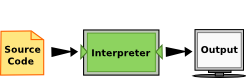

## Overview

1. History
1. Installing & Running Python
1. Working with Python using VSCode

::: notes

:::

## History

- Invented in the Netherlands, early 90s by Guido van Rossum
- Named after Monty Python
- Open sourced
- Designed to be human readable
- Scalable, object oriented and functional
- Active community

::: notes

:::

## Installing Python

- Python is pre-installed on most Unix systems, Linux and MAC OS X
- The pre-installed version may not be the most recent one
- Download from http://python.org/download/
- Python comes with a large library of standard modules.
- Remember to add Python to the path variable!

::: notes

:::

## Running Python

- Considered a scripting language, but is much more
- Python interpreter evaluates each expression
- Python programs can act both as a script and as a module to be and used by another python program.

::: notes

:::

## VSCode

- There are several options for an IDE.
- We will use VSCode.
- Python extension available.

::: notes

:::

## Python Programming Language

- Two kinds of programs process high-level languages into low-level languages:
    - Interpreters: Reads a high-level program and executes it.
    - Compilers: Translates program into an executable before it is run.
- Python uses both processes, but because of the way programmers interact with it, it is usually considered an interpreted language.

::: notes

:::

