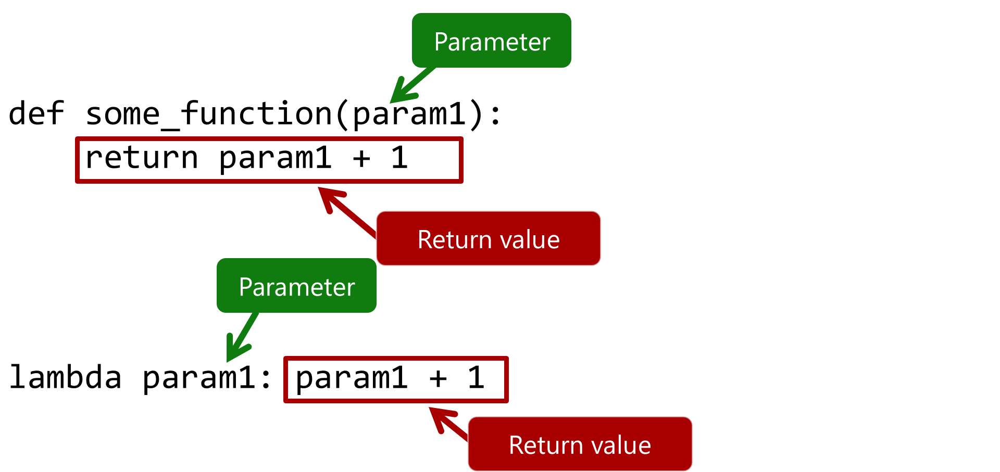

# Module 3

## Overview

1. Conditional Statements
1. Error Handling
1. Functions
1. Lambda functions

## Conditional Statements

```python
if country == 'canada':
    print('Oh look a Canadian')
elif country == 'england':
    print('Oh look an english gentleman')
else:
    print('Not sure where you live')
```

| Symbol  | Operation                 |
|---------|---------------------------|
| >       | Greater than              |
| <       | Less than                 |
| >=      | Greater than or equal to  |
| <=      | Less than or equal to     |
| ==      | is equal to               |
| !=      | is not equal to           |
| x in [a,b,c] | Does x match the value of a, b, or c |


::: notes
country == 'canada'
How you indent your code changes execution

String comparisons are case sensitive

Use string functions to make case insensitive comparisons
.lower() 
:::

## Complex conditions

```python
if gpa >= .85:
	if lowest_grade >= .70:
		print('Well done')
```

```python
if gpa >= .85 and lowest_grade >= .70:
	print('Well done')
```

| First  | Second | And   | Or    |
|--------|--------|-------|-------|
| TRUE   | TRUE   | TRUE  | TRUE  |
| TRUE   | FALSE  | FALSE | TRUE  |
| FALSE  | TRUE   | FALSE | TRUE  |
| FALSE  | FALSE  | FALSE | FALSE |

::: notes
Requirements for honour roll

Minimum 85% grade point average

Lowest grade is at least 70%
:::

## Handling runtime error

- Recover from error state
- Logging
- Graceful exit

```python
try:
    print(x / y)
except ZeroDivisionError as e:
    # Optionally, log e somewhere
    print('Sorry, something went wrong')
except:
    print('Something really went wrong')
finally:
    print('This always runs on success or failure')
```

::: notes

Notes:
- built-in Exceptions: https://docs.python.org/3/library/exceptions.html
- handle from more specific to more generic

- When to use:
    - User input
    - Accessing an external system
    - REST call
    - File system

:::

## Functions

- Encapsulate Logic.
- Can receive none, one or more input parameters.
- Can return values.

```python
def get_initial(name):
	initial = name[0:1].upper()
	return initial

first_name = input('Enter your first name: ')
first_name_initial = get_initial(first_name)
last_name = input('Enter your last name: ')
last_name_initial = get_initial(last_name)
```

```
Enter your first name: John
Enter your last name: Doe
Your initials are: SI
```

::: notes

:::

## Lambda Functions

- Inline function
- Anonymous, may not have a name
- Frequently used with higher-order functions which take functions as arguments



```python
(lambda x: x + 1)(2)
```
::: notes

:::