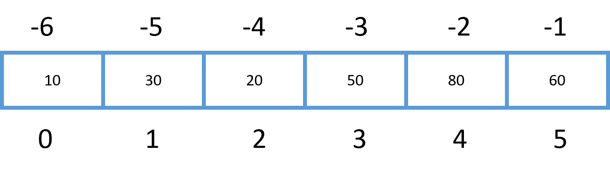

## Overview

1. Lists
1. Arrays
1. Slicing
1. Tuples
1. Sets

## Lists

- Lists are collections of items.
- Lists can be expanded or contracted as needed.
- Can contain any data type.
- Used to store a single column collection of information



::: notes

:::

## Nested Lists

- It is possible to nest lists.

```python 
x[1] # second element of first list
x[1][1] # second element of second list
x[1][1][1] # 80
```


::: notes

:::


## Working with lists

```python
empty_list = []
empty_list = list()

names = ['James', 'David']
scores = []
scores.append(98) # Add new item to the end
scores.append(99)

print(names) # ['Christopher', 'Susan']
print(scores) # [98,99]
print(scores[1]) # 99
```

::: notes

:::

## Arrays

- Arrays are collections of items.
- Designed to store a uniform basic data type, such as integers or floating point numbers.
- Use array module

```python
from array import array
scores = array('d')
scores.append(97)
scores.append(98)
print(scores)
print(scores[1])

```

::: notes

Notes:
- from array library
- Later module will talk about libraries and modules and packages.
- Basically we are importing an array

:::

## Lists Vs. Arrays

- Arrays:
  - Simple types such as numbers
  - Must all be the same type
- Lists:
  - Store anything
  - Store any type

::: notes

Notes:
- numpy will give you additional support

:::

## Common Operations

```bash
names = ['James', 'David']
print(len(names)) # Get the number of items
names.insert(0, 'Bill') # Insert before index
print(names)
names.sort()
print(names)
```

```
2
['Bill', 'James', 'David']
['Bill', 'David', 'James']
```

::: notes
sorts side effect is that it will modify the list
:::

## Slicing

```python
a[start:stop]  # items start through stop-1
a[start:]      # items start through the rest of the array
a[:stop]       # items from the beginning through stop-1
a[:]           # a copy of the whole array
a[start:stop:step] # start through not past stop, by step

a[-1]    # last item in the array
a[-2:]   # last two items in the array
a[:-2]   # everything except the last two items

a[::-1]    # all items in the array, reversed
a[1::-1]   # the first two items, reversed
a[:-3:-1]  # the last two items, reversed
a[-3::-1]  # everything except the last two items, reversed
```

:::notes
If you ask for a[:-2] and a only contains one element, you get an empty list instead of an error.

a[start:stop:step]

is equivalent to:

a[slice(start, stop, step)]
:::

## Slicing

```python
names = ['James', 'David', 'Bill','Justin']
names
names[3]
names[1:3]
names[:3]
```

```
['James', 'David', 'Bill','Justin']
['Justin']
['David', 'Bill']
['James', 'David', 'Bill']
```

::: notes
:::

## Sorting

- **sorted()** can be used on lists, tuples and sets.
- **sort()** can only be used with lists
- **sort()** returns None and modifies the values in place

::: notes
:::

## Sorting complex objects

```json
persons = [
  {'name': 'James', 'age': 50},
  {'name': 'David', 'age': 47}
]
```
Error: TypeError: '<' not supported between instances of 'dict' and 'dict' 

```python
persons.sort()
print(persons)
```

Works!

```python
def sorter(item):
    return item['name']

presenters.sort(key=sorter)
```

::: notes
:::

## Dictionaries

- Dictionaries are key/value pairs of a collection of items.
- Dictionaries use keys to identify each item.

```python
empty_dictionary = {}
empty_dictionary = dict()

person = {'first': 'John'}
person['last'] = 'Doe'

print(person)
print(person['first'])
```

```
{'first': 'John', 'last': 'Doe'}
John
```

::: notes
:::

## Dictionaries Vs Lists 

- Dictionaries:
  - Key/Value pairs
  - Storage order not guaranteed
- Lists:
  - Zero-based index
  - Storage order guaranteed

::: notes

:::

## Tuples

- Create a tuple
  ```python
  empty_tuple = ()
  empty_tuple = tuple()
  
  tup = ('32', 4, 'yes', 3.14)
  ```
- Similar to lists:
  ```python
  tup[1:4] # (4, 'yes', 3.14)
  ```
- Tuples are immutable

::: notes

Notes:
https://docs.python.org/2/library/functions.html#tuple

:::

## Sets

- Sets are unordered.
- Set elements are unique. Duplicate elements are not allowed.
- Common operations: union, intersect, and difference.


```python
empty_set = set()

set1 = {1, 5, 10, 15, 20}
set2 = {2, 5, 11, 15, 21}
```

::: notes

:::


