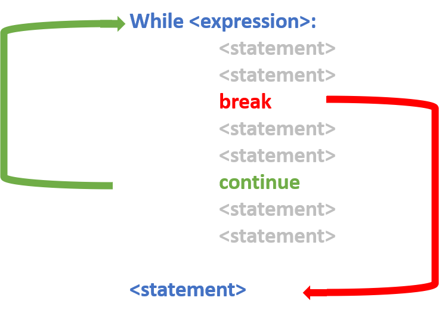

# Module 5

## Overview

1. Loops
1. Map
1. filter
1. Reduce
1. List comprehensions

::: notes
:::

## For loops

For loops takes each item in an array or collection in order, and assigns it to the variable you define.

```python
# Loop through a collection
for name in ['David', 'James']:
  print(name)
```

```python
#Loop a number of times
for index in range(0, 2):
  print(index)
```

::: notes
:::

## While loop

While loops perform an operation as long as a condition is true.

```python
names = ['David', 'James']
index = 0
while index < len(names):
	print(names[index])
	# Change the condition!!
	index = index + 1
```

::: notes
:::

## Terminate loop



::: notes
- **break** terminates loop and proceeds to the first statement following the loop.
- **continue** terminates the current loop iteration and jumps to the top of the loop.
:::

## The else statement

```python
while i < 6:
  print(i)
  if i == 0:
    break
  i += 1
else:
  print("i is no longer less than 6")
```

::: notes
The else clause will be executed only if the loop terminates “by exhaustion”—that is, if the loop iterates until the controlling condition becomes false. If the loop is exited by a break statement, the else clause won’t be executed.
:::

## The else statement

```python
while i < 6:
  print(i)
  if i == 0:
    break
  i += 1
else:
  print("i is no longer less than 6")
```

:::notes
The else clause will be executed only if the loop terminates “by exhaustion”—that is, if the loop iterates until the controlling condition becomes false. If the loop is exited by a break statement, the else clause won’t be executed.
:::

## Filtering

- filter() functional programming primitive.
- Tests if each element of a sequence true or not.
- Returns an iterator that is already filtered.

```python
# sequence
sequence = ['a', 'b', 'c', 'd', 'e', 'f', 'g', 'h']

def is_vowel(variable):
    letters = ['a', 'e', 'i', 'o', 'u']
    if (variable in letters):
        return True
    else:
        return False
  
# using filter function
filtered = filter(is_vowel, sequence)
  
print('The filtered letters are:')
for s in filtered:
    print(s)
```

::: notes
:::

## Reduction

- **reduce()** applies a function to an iterable and reduce it to a single cumulative value.
- Popular in functional programming.

```python
from functools import reduce

def addition(a, b):
  return = a + b

numbers = [0, 1, 2, 3, 4]

reduce(addition, numbers)
```
Output:
```bash
10
```

::: notes
:::

## Using map()

- Alternative approach that’s based in functional programming.
- You pass in a function and an iterable, and map() will create an object. 
- This object contains the output you would get from running each iterable element through the supplied function.

```python
fruits = ["apple", "banana", "cherry"]
newlist = []

for x in fruits:
  if "a" in x:
    newlist.append(x.upper())

print(newlist)
```

```python
fruits = ["apple", "banana", "cherry"]

def copy_list(fruits):
  return fruits.upper()

new_list = map(copy_list, fruits)

print(new_list)
```

```bash
['APPLE', 'BANANA', 'MANGO']
```

::: notes
:::

## Lambda Functions

- Alternative approach that’s based in functional programming.
- You pass in a function and an iterable, and map() will create an object. 
- This object contains the output you would get from running each iterable element through the supplied function.

```python
fruits = ["apple", "banana", "cherry"]

new_list = map(lambda fruits: fruits.upper())

print(ne_w_list)
```

```bash
['APPLE', 'BANANA', 'MANGO']
```

::: notes
:::

## List Comprehensions

- Shorter syntax when you want to create a new list based on the values of an existing list.
- new_list = [expression for member in iterable]

```python
fruits = ["apple", "banana", "cherry"]
newlist = []

def copy_list(fruits):
  return fruits.upper()

newlist = map(copy_list, fruits)

print(newlist)
```

```python
fruits = ["apple", "banana", "cherry", "kiwi", "mango"]

newlist = [x for x in fruits if "a" in x]

print(newlist)
```

```bash
['apple', 'banana', 'mango']
```

::: notes

Notes:

Considered more Pythonic:
1. Can be used for mapping and filtering. You don’t have to use a different approach for each scenario.
  This is the main reason why list comprehensions are considered Pythonic, as Python embraces simple, powerful tools that you can use in a wide variety of situations. 
1. You don't need to remember the proper order of arguments like you would when you call map().
1. List comprehensions are also more declarative than loops, which means they’re easier to read and understand. 
  Loops require you to focus on how the list is created.

**Warning!**
List comprehensions might make your code run more slowly or use more memory. If your code is less performant or harder to understand, then it’s probably better to choose an alternative.

:::