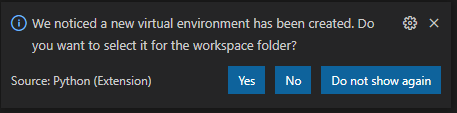

## Overview

1. Using modules 
1. Packages
1. Creating modules
1. Python virtual environment

## Modules Overview

- A Python file with functions, classes and other components.
- Break code down into reusable structures.
- Referenced by using the import statement.
- It is customary but not required to place all import statements at the beginning of a module.
- To speed up loading modules, Python caches the compiled version of each module in the **__pycache__** directory under the name module.version.pyc


```python
# import module as namespace
import helpers
helpers.display('Not a warning')

# import all into current namespace
from helpers import *
display('Not a warning')

# import specific items into current namespace
from helpers import display
display('Not a warning')
```

::: notes
:::

## Packages

- Modules can be distributed using a Package.
- A Package is a published collection of modules.
- Defines a namespace like PythonEssentials.Calculator
- You can publish to, and install from pypi.org.
- Install package with pip.


```python
# Install an individual package
pip install colorama

# Install from a list of packages
pip install -r requirements.txt

# requirements.txt
colorama
```


::: notes
:::

## Creating Packages

- The **__init__.py** files tell Python to treat directories containing the file as packages.
- The __init__.py can be an empty file, but it can also execute initialization code for the package.

```
PythonEssentials/
                __init__.py
                calculators/
                            __init__.py
                            simple_calculator.py
                            advanced_calculator.py
                parsers/
                            __init_.py
                            console_input_parser.py
                            console_output_parser.py
                            file_input_parser.py
                            file_output_parser.py
```
```python
import python_essentials.calculators.simple_calculator
from python_essentials.parsers import console_input_parser, console_output_parser
```


::: notes
:::

## Python Virtual Environment

- Isolated environment where to install your dependencies.
- Create virtual environnement.

    ```bash
    python -m venv .venv
    ```

- Activate virtual environment in VS Code.

    

- Activate virtual environment in command line
    ```bash
    .\.venv\Scripts\activate
    ```

- Create Requirements file
    ```bash
    python -m pip freeze > requirements.txt
    ```

::: notes

- https://packaging.python.org/guides/installing-using-pip-and-virtual-environments/
- https://code.visualstudio.com/docs/python/debugging
- https://code.visualstudio.com/docs/python/environments

:::

