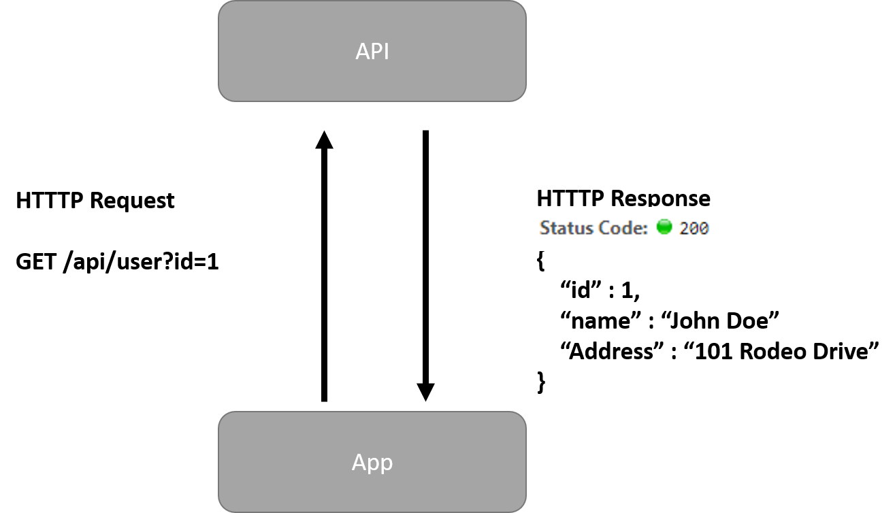

# Module 10

## Overview

1. Asynchronous Operations
1. Calling Web APIs

::: notes
:::

## Async Overview

- Consider using with operations take a long time
	- Web calls
	- Network IO
	- Complex data processing

::: notes
:::

## Writing Async operations

- asyncio package. 
- async/await
- create_task

```python
async def load_data(session, delay):
	async with aiohttp.ClientSession() as session:
		
		task_one = asyncio.create_task(load_data(session, 2))
		task_two = asyncio.create_task(load_data(session, 3))

		result_one = await task_one 
		result_two = await task_two
```
:::notes

Notes: 

with will do automatically clean up, but we don't want it to clean up before we finish our async ops. The keyword asyc tells with to remember to wait.

**Operations:**
- run:  Runtime for asynchronous functions
- create_task: Creates a handle (or coroutine) and schedules execution
- gather: Create a collection of tasks to execute and wait for completion

**Creating coroutines (functions using async/await):**
- async: Flag to create a coroutine (function with an await call)
- await: "Pauses" code to wait for response

:::

## Web APIs



:::notes
:::


