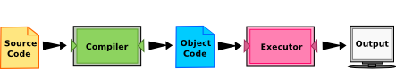
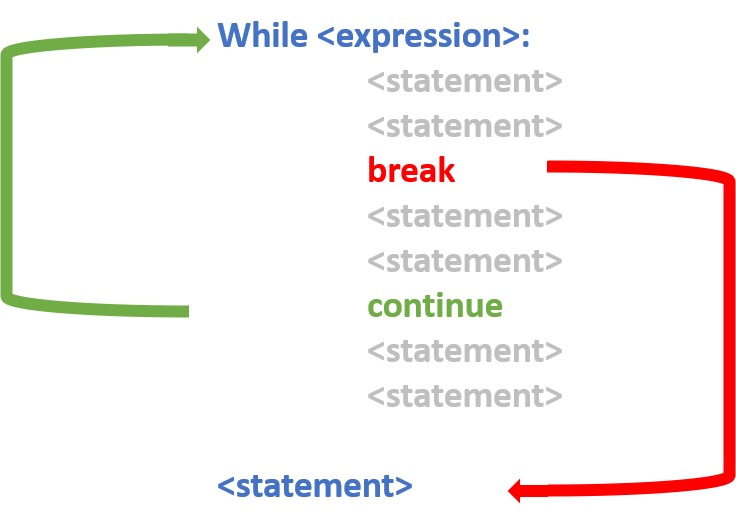

Syllabus
--------

1.  Overview of Python

2.  Flow Control

3.  Sequence Types

4.  Sorting and Slicing

5.  Functions

6.  Dictionaries and Sets

7.  Object-oriented Python

8.  Creating and Using Modules

9.  Async & Web APIs

10. Working with Files

11. Regular Expressions

12. Using the Standard Library
    --------------------------

    title: Lesson 1 subtitle: Python Essentials ---

Overview
--------

1.  History
2.  Installing & Running Python
3.  Working with Python using VSCode

::: {.notes}
:::

History
-------

-   Invented in the Netherlands, early 90s by Guido van Rossum
-   Named after Monty Python
-   Open sourced
-   Designed to be human readable
-   Scalable, object oriented and functional
-   Active community

::: {.notes}
:::

Installing Python
-----------------

-   Python is pre-installed on most Unix systems, Linux and MAC OS X
-   The pre-installed version may not be the most recent one
-   Download from http://python.org/download/
-   Python comes with a large library of standard modules.
-   Remember to add Python to the path variable!


::: {.notes}
:::

Running Python
--------------

-   Considered a scripting language, but is much more
-   Python interpreter evaluates each expression
-   Python programs can act both as a script and as a module to be and
    used by another python program.

::: {.notes}
:::

VSCode
------

-   There are several options for an IDE.
-   We will use VSCode.
-   Python extension available.


::: {.notes}
:::

Python Programming Language
---------------------------

-   Two kinds of programs process high-level languages into low-level
    languages:
    -   Interpreters: Reads a high-level program and executes it.
    -   Compilers: Translates program into an executable before it is
        run.
-   Python uses both processes, but because of the way programmers
    interact with it, it is usually considered an interpreted language.




::: {.notes}
:::

Overview
--------

1.  Print
2.  Comments
3.  Strings
4.  Numbers

Print
-----

``` {.python}
print('Hello world')
print()
print("Hello world double quotes")
print('Blank line \nin the middle of string')
```

::: {.notes}
:::

Comments
--------

``` {.python}
# This is a comment in my code it does nothing
# print('Hello world')
# print("Hello world")
# No output will be displayed!
```

::: {.notes}
:::

Data Types
----------

-   **Text:** str
-   **Numeric:** int, float, complex
-   **Sequence:** list, tuple, range
-   **Mapping:** dict
-   **Set:** set, frozenset
-   **Boolean:** bool
-   **Binary:** bytes, bytearray, memoryview

::: {.notes}
:::

String
------

``` {.python}
first_name = 'John'
last_name = 'Doe'
print(first_name + last_name)
print('Hello ' + first_name + ' ' + last_name)
print('Hello {} {}'.format(first_name, last_name))
print('Hello {0} {1}'.format(first_name, last_name))
print(f'Hello {first_name} {last_name}') # maybe best
```

``` {.python}
sentence = 'The dog is named Sammy'
print(sentence.upper())
print(sentence.lower())
print(sentence.capitalize())
print(sentence.count('a'))
```

::: {.notes}
:::

Numbers
-------

``` {.python}
first_num = 6
second_num = 2
print(first_num + second_num)
print(first_num ** second_num)

days_in_feb = 28
print(str(days_in_feb) + ' days in February')

first_num = '5'
second_num = '6'
print(first_num + second_num) #Output: 56

first_num = input('Enter first number ')
second_num = input('Enter second number ')
print(int(first_num) + int(second_num)) # Output: 11
```

::: {.notes}
Notes:

-   When displaying a string that contains numbers you must convert the
    numbers into strings.
-   Numbers can be stored as strings
-   Numbers stored as strings are treated as strings.
-   The input function always returns strings.
:::

Working with numbers
--------------------

  Symbol   Operation
  -------- ----------------
  \+       Addition
  \-       Subtraction
  \*       Multiplication
  /        Division
  \*\*     Exponent

::: {.notes}
:::

Overview
--------

1.  Conditional Statements
2.  Error Handling
3.  Functions
4.  Lambda functions

Conditional Statements
----------------------

``` {.python}
if country == 'canada':
    print('Oh look a Canadian')
elif country == 'england':
    print('Oh look an english gentleman')
else:
    print('Not sure where you live')
```

  Symbol           Operation
  ---------------- --------------------------------------
  \>               Greater than
  \<               Less than
  \>=              Greater than or equal to
  \<=              Less than or equal to
  ==               is equal to
  !=               is not equal to
  x in \[a,b,c\]   Does x match the value of a, b, or c

::: {.notes}
country == 'canada' How you indent your code changes execution

String comparisons are case sensitive

Use string functions to make case insensitive comparisons .lower()
:::

Complex conditions
------------------

``` {.python}
if gpa >= .85:
    if lowest_grade >= .70:
        print('Well done')
```

``` {.python}
if gpa >= .85 and lowest_grade >= .70:
    print('Well done')
```

  First   Second   And     Or
  ------- -------- ------- -------
  TRUE    TRUE     TRUE    TRUE
  TRUE    FALSE    FALSE   TRUE
  FALSE   TRUE     FALSE   TRUE
  FALSE   FALSE    FALSE   FALSE

::: {.notes}
Requirements for honour roll

Minimum 85% grade point average

Lowest grade is at least 70%
:::

Handling runtime error
----------------------

-   Recover from error state
-   Logging
-   Graceful exit

``` {.python}
try:
    print(x / y)
except ZeroDivisionError as e:
    # Optionally, log e somewhere
    print('Sorry, something went wrong')
except:
    print('Something really went wrong')
finally:
    print('This always runs on success or failure')
```

::: {.notes}
Notes: - built-in Exceptions:
https://docs.python.org/3/library/exceptions.html - handle from more
specific to more generic

-   When to use:
    -   User input
    -   Accessing an external system
    -   REST call
    -   File system
:::

Functions
---------

-   Encapsulate Logic.
-   Can receive none, one or more input parameters.
-   Can return values.

``` {.python}
def get_initial(name):
    initial = name[0:1].upper()
    return initial

first_name = input('Enter your first name: ')
first_name_initial = get_initial(first_name)
last_name = input('Enter your last name: ')
last_name_initial = get_initial(last_name)
```

    Enter your first name: John
    Enter your last name: Doe
    Your initials are: SI

::: {.notes}
:::

Lambda Functions
----------------

-   Inline function
-   Anonymous, may not have a name
-   Frequently used with higher-order functions which take functions as
    arguments


``` {.python}
(lambda x: x + 1)(2)
```

::: {.notes}
:::

Overview
--------

1.  Lists
2.  Arrays
3.  Slicing
4.  Tuples
5.  Sets

Lists
-----

-   Lists are collections of items.
-   Lists can be expanded or contracted as needed.
-   Can contain any data type.
-   Used to store a single value or a collection.


::: {.notes}
:::

Nested Lists
------------

-   It is possible to nest lists.

``` {.python}
x[1] # second element of first list
x[1][1] # second element of second list
x[1][1][1] # 80
```


::: {.notes}
:::

Working with lists
------------------

``` {.python}
empty_list = []
empty_list = list()

names = ['James', 'David']
scores = []
scores.append(98) # Add new item to the end
scores.append(99)

print(names) # ['James', 'David']
print(scores) # [98,99]
print(scores[1]) # 99
```

::: {.notes}
:::

Arrays
------

-   Arrays are collections of items.
-   Designed to store a uniform basic data type, such as integers or
    floating point numbers.
-   Use array module

``` {.python}
from array import array
scores = array('d')
scores.append(97)
scores.append(98)
print(scores)
print(scores[1])
```

::: {.notes}
Notes: - from array library - Later module will talk about libraries and
modules and packages. - Basically we are importing an array
:::

Lists Vs. Arrays
----------------

-   Arrays:
    -   Simple types such as numbers
    -   Must all be the same type
-   Lists:
    -   Store anything
    -   Store any type

::: {.notes}
Notes: - numpy will give you additional support
:::

Common Operations
-----------------

``` {.bash}
names = ['James', 'David']
print(len(names)) # Get the number of items
names.insert(0, 'Bill') # Insert before index
print(names)
names.sort()
print(names)
```

    2
    ['Bill', 'James', 'David']
    ['Bill', 'David', 'James']

::: {.notes}
sorts side effect is that it will modify the list
:::

Slicing
-------

``` {.python}
a[start:stop]  # items start through stop-1
a[start:]      # items start through the rest of the array
a[:stop]       # items from the beginning through stop-1
```

``` {.python}
names = ['10', '30', '20','50','80','60']

names       # Output: ['10', '30', '20','50','80','60']
names[3]    # Output: ['50']
names[1:3]  # Output: ['30', '20']
names[:3]   # Output: ['10', '30', '20']
```


::: {.notes}
:::

More Slicing
------------

``` {.python}
a[start:stop]  # items start through stop-1
a[start:]      # items start through the rest of the array
a[:stop]       # items from the beginning through stop-1
a[:]           # a copy of the whole array
a[start:stop:step] # start through not past stop, by step

a[-1]    # last item in the array
a[-2:]   # last two items in the array
a[:-2]   # everything except the last two items

a[::-1]    # all items in the array, reversed
a[1::-1]   # the first two items, reversed
a[:-3:-1]  # the last two items, reversed
a[-3::-1]  # everything except the last two items, reversed
```


::: {.notes}
If you ask for a\[:-2\] and a only contains one element, you get an
empty list instead of an error.

a\[start:stop:step\]

is equivalent to:

a\[slice(start, stop, step)\]
:::

Sorting
-------

-   **sorted()** can be used on lists, tuples and sets.
-   **sort()** can only be used with lists
-   **sort()** returns None and modifies the values in place

::: {.notes}
:::

Sorting complex objects
-----------------------

``` {.json}
persons = [
  {'name': 'James', 'age': 50},
  {'name': 'David', 'age': 47}
]
```

Error: TypeError: '\<' not supported between instances of 'dict' and
'dict'

``` {.python}
persons.sort()
print(persons)
```

Works!

``` {.python}
def sorter(item):
    return item['name']

presenters.sort(key=sorter)
```

::: {.notes}
:::

Dictionaries
------------

-   Dictionaries are key/value pairs of a collection of items.
-   Dictionaries use keys to identify each item.

``` {.python}
empty_dictionary = {}
empty_dictionary = dict()

person = {'first': 'John'}
person['last'] = 'Doe'

print(person)
print(person['first'])
```

    {'first': 'John', 'last': 'Doe'}
    John

::: {.notes}
:::

Dictionaries Vs Lists
---------------------

-   Dictionaries:
    -   Key/Value pairs
    -   Storage order not guaranteed
-   Lists:
    -   Zero-based index
    -   Storage order guaranteed

::: {.notes}
:::

Tuples
------

-   Create a tuple

    ``` {.python}
    empty_tuple = ()
    empty_tuple = tuple()

    tup = ('32', 4, 'yes', 3.14)
    ```

-   Similar to lists:

    ``` {.python}
    tup[1:4] # (4, 'yes', 3.14)
    ```

-   Tuples are immutable

::: {.notes}
Notes: https://docs.python.org/2/library/functions.html\#tuple
:::

Sets
----

-   Sets are unordered.
-   Set elements are unique. Duplicate elements are not allowed.
-   Common operations: union, intersect, and difference.


``` {.python}
empty_set = set()

set1 = {1, 5, 10, 15, 20}
set2 = {2, 5, 11, 15, 21}
```

::: {.notes}
:::

Overview
--------

1.  Loops
2.  Map
3.  filter
4.  Reduce
5.  List comprehensions

::: {.notes}
:::

For loops
---------

For loops takes each item in an array or collection in order, and
assigns it to the variable you define.

``` {.python}
# Loop through a collection
for name in ['David', 'James']:
  print(name)
```

``` {.python}
#Loop a number of times
for index in range(0, 2):
  print(index)
```

::: {.notes}
:::

While loop
----------

While loops perform an operation as long as a condition is true.

``` {.python}
names = ['David', 'James']
index = 0
while index < len(names):
    print(names[index])
    # Change the condition!!
    index = index + 1
```

::: {.notes}
:::

Terminate loop
--------------



::: {.notes}
-   **break** terminates loop and proceeds to the first statement
    following the loop.
-   **continue** terminates the current loop iteration and jumps to the
    top of the loop.
:::

The else statement
------------------

``` {.python}
while i < 6:
  print(i)
  if i == 0:
    break
  i += 1
else:
  print("i is no longer less than 6")
```

::: {.notes}
The else clause will be executed only if the loop terminates "by
exhaustion"---that is, if the loop iterates until the controlling
condition becomes false. If the loop is exited by a break statement, the
else clause won't be executed.
:::

The else statement
------------------

``` {.python}
while i < 6:
  print(i)
  if i == 0:
    break
  i += 1
else:
  print("i is no longer less than 6")
```

::: {.notes}
The else clause will be executed only if the loop terminates "by
exhaustion"---that is, if the loop iterates until the controlling
condition becomes false. If the loop is exited by a break statement, the
else clause won't be executed.
:::

Filtering
---------

-   filter() functional programming primitive.
-   Tests if each element of a sequence true or not.
-   Returns an iterator that is already filtered.

``` {.python}
# sequence
sequence = ['a', 'b', 'c', 'd', 'e', 'f', 'g', 'h']

def is_vowel(variable):
    letters = ['a', 'e', 'i', 'o', 'u']
    if (variable in letters):
        return True
    else:
        return False
  
# using filter function
filtered = filter(is_vowel, sequence)
  
print('The filtered letters are:')
for s in filtered:
    print(s)
```

::: {.notes}
:::

Reduction
---------

-   **reduce()** applies a function to an iterable and reduce it to a
    single cumulative value.
-   Popular in functional programming.

``` {.python}
from functools import reduce

def addition(a, b):
  return = a + b

numbers = [0, 1, 2, 3, 4]

reduce(addition, numbers)
```

Output:

``` {.bash}
10
```

::: {.notes}
:::

Using map()
-----------

-   Alternative approach that's based in functional programming.
-   You pass in a function and an iterable, and map() will create an
    object.
-   This object contains the output you would get from running each
    iterable element through the supplied function.

``` {.python}
fruits = ["apple", "banana", "cherry"]
newlist = []

for x in fruits:
  if "a" in x:
    newlist.append(x.upper())

print(newlist)
```

``` {.python}
fruits = ["apple", "banana", "cherry"]

def copy_list(fruits):
  return fruits.upper()

new_list = map(copy_list, fruits)

print(new_list)
```

``` {.bash}
['APPLE', 'BANANA', 'MANGO']
```

::: {.notes}
:::

Lambda Functions
----------------

-   Alternative approach that's based in functional programming.
-   You pass in a function and an iterable, and map() will create an
    object.
-   This object contains the output you would get from running each
    iterable element through the supplied function.

``` {.python}
fruits = ["apple", "banana", "cherry"]

new_list = map(lambda fruits: fruits.upper())

print(ne_w_list)
```

``` {.bash}
['APPLE', 'BANANA', 'MANGO']
```

::: {.notes}
:::

List Comprehensions
-------------------

-   Shorter syntax when you want to create a new list based on the
    values of an existing list.
-   new_list = \[expression for member in iterable\]

``` {.python}
fruits = ["apple", "banana", "cherry"]
newlist = []

def copy_list(fruits):
  return fruits.upper()

newlist = map(copy_list, fruits)

print(newlist)
```

``` {.python}
fruits = ["apple", "banana", "cherry", "kiwi", "mango"]

newlist = [x for x in fruits if "a" in x]

print(newlist)
```

``` {.bash}
['apple', 'banana', 'mango']
```

::: {.notes}
Notes:

Considered more Pythonic: 1. Can be used for mapping and filtering. You
don't have to use a different approach for each scenario. This is the
main reason why list comprehensions are considered Pythonic, as Python
embraces simple, powerful tools that you can use in a wide variety of
situations. 1. You don't need to remember the proper order of arguments
like you would when you call map(). 1. List comprehensions are also more
declarative than loops, which means they're easier to read and
understand. Loops require you to focus on how the list is created.

**Warning!** List comprehensions might make your code run more slowly or
use more memory. If your code is less performant or harder to
understand, then it's probably better to choose an alternative.
:::

Overview
--------

1.  Classes
2.  Inheritance
3.  Mixins

Classes Overview
----------------

-   Create reusable components
-   Group data and operations together
-   Classes are nouns
-   Properties are adjectives
-   Methods are verbs

::: {.notes}
:::

Creating Classes
----------------

``` {.python}
class Presenter():
    
    def __init__(self, name):
        # Constructor
        self.name = name
    
    def say_hello(self):
        # method
        print('Hello, ' + self.name)
    
    @property
    def name(self):
        return self.__name
    
    @name.setter
    def name(self, value):
        # cool validation here
        self.__name = value
```

::: {.notes}
:::

Using Classes
-------------

``` {.python}
presenter = Presenter('James')
presenter.name = 'James'
presenter.say_hello()
print(presenter.name)
```

::: {.notes}
:::

Accessibility in Python
-----------------------

-   **EVERYTHING is public**
-   Conventions for suggesting accessibility
-   \_ protected
-   \_\_ (double underscore) private

::: {.notes}
:::

Inheritance
-----------

-   Creates an "is a" relationship
    -   Student is a Person
    -   SqlConnection is a DatabaseConnection
    -   MySqlConnection is a DatabaseConnection
-   Composition (with properties) creates a "has a" relationship
    -   Student has a Class
    -   DatabaseConnection has a ConnectionString

::: {.notes}
:::

Python Inheritance
------------------

-   All methods are "virtual"
    -   Can override or redefine their behavior
-   Keyword super to access parent class
    -   Constructor
    -   Properties in methods
-   Must always call parent constructor

::: {.notes}
:::

Inheriting from a class
-----------------------

``` {.python}
class Person:
    def __init__(self, name):
        self.name = name
    def say_hello(self):
        print('Hello, ' + self.name)

class Student(Person):
    def __init__(self, name, school):
        super().__init__(name)
        self.school = school
    def sing_school_song(self):
        print('Ode to ' + self.school)
```

::: {.notes}
:::

Using a derived class
---------------------

``` {.python}
student = Student('John', 'Doe')
student.say_hello()
student.sing_school_song()

print(isinstance(student, Student))
print(isinstance(student, Person))
print(issubclass(Student, Person))
```

::: {.notes}
:::

Mixins
------

-   Inherit from multiple classes.
-   A little controversial.
-   Can get messy quickly.
-   Many modern languages only support single inheritance.
-   Uses:
    -   Enable functionality for frameworks such as Django.
    -   Streamline repetitious operations.

::: {.notes}
:::

Using mixins
------------

``` {.python}
class Loggable:
    def __init__(self):
        self.title = ''
    def log(self):
        print('Log message from ' + self.title)

class Connection:
    def __init__(self):
        self.server = ''
    def connect(self):
        print('Connecting to database on ' + self.server)

class SqlDatabase(Connection, Loggable):
    def __init__(self):
        super().__init__()
        self.title = 'Sql Connection Demo'
        self.server = 'Some_Server'

def framework(item):
    # Perform the connection
    if isinstance(item, Connection):
        item.connect()
    # Log the operation
    if isinstance(item, Loggable):
        item.log()

# Create an instance of our class
sql_connection = SqlDatabase()
# Use our framework
framework(sql_connection) # connects and logs
```

::: {.notes}
Notes:

-   Create:
    -   Helper database class
    -   Create different types for different databases
-   Function:
    -   Connect to a database
    -   Log what it's doing
:::

Enumerators
-----------

-   Set of names bound to unique, constant values.
-   **name** keyword displays the name of the enum.
-   Use **type()** to check the enum types
-   import **enum**

``` {.python}
import enum
class Colour(enum.Enum):
    RED = 1
    GREEN = 2
    BLUE = 3

print(c is Colour.RED)
```

``` {.bash}
True
```

::: {.notes}
Notes:
:::

Overview
--------

1.  Using modules
2.  Packages
3.  Creating modules
4.  Python virtual environment

Modules Overview
----------------

-   A Python file with functions, classes and other components.
-   Break code down into reusable structures.
-   Referenced by using the import statement.
-   It is customary but not required to place all import statements at
    the beginning of a module.
-   To speed up loading modules, Python caches the compiled version of
    each module in the ****pycache**** directory under the name
    module.version.pyc

``` {.python}
# import module as namespace
import helpers
helpers.display('Not a warning')

# import all into current namespace
from helpers import *
display('Not a warning')

# import specific items into current namespace
from helpers import display
display('Not a warning')
```

::: {.notes}
:::

Packages
--------

-   Modules can be distributed using a Package.
-   A Package is a published collection of modules.
-   Defines a namespace like PythonEssentials.Calculator
-   You can publish to, and install from pypi.org.
-   Install package with pip.

``` {.python}
# Install an individual package
pip install colorama

# Install from a list of packages
pip install -r requirements.txt

# requirements.txt
colorama
```


::: {.notes}
:::

Creating Packages
-----------------

-   The `__init__.py` files tell Python to treat directories containing
    the file as packages.
-   The `__init__.py` can be an empty file, but it can also execute
    initialization code for the package.

```{=html}
<!-- -->
```
    PythonEssentials/
                    __init__.py
                    calculators/
                                __init__.py
                                simple_calculator.py
                                advanced_calculator.py
                    parsers/
                                __init__.py
                                console_input_parser.py
                                console_output_parser.py
                                file_input_parser.py
                                file_output_parser.py

``` {.python}
import python_essentials.calculators.simple_calculator
from python_essentials.parsers import console_input_parser, console_output_parser
```


::: {.notes}
:::

Python Virtual Environment
--------------------------

-   Isolated environment where to install your dependencies.

-   Create virtual environnement.

    ``` {.bash}
    python -m venv .venv
    ```

-   Activate virtual environment in VS Code.

    

-   Activate virtual environment in command line
    `bash     .\.venv\Scripts\activate`

-   Create Requirements file
    `bash     python -m pip freeze > requirements.txt`

::: {.notes}
-   https://packaging.python.org/guides/installing-using-pip-and-virtual-environments/
-   https://code.visualstudio.com/docs/python/debugging
-   https://code.visualstudio.com/docs/python/environments
:::

Overview
--------

1.  Clean code
2.  Linting

This is valid, but it is clean?
-------------------------------

``` {.python}
x = 12
if x== 24:
 print('Is valid')
else:
    print("Not valid")

def helper(name='sample'):
 pass

def convertTouc( name = 'sample' ):
         return name.upper()
```

::: {.notes}
touc: to upper case
:::

Why clean code?
---------------

-   Makes code readable
-   Easier to debug
-   Easier to maintain by you and others

::: {.notes}
:::

Spacing
-------

-   Spaces, not tabs
-   VSCode automatically converts tabs to spaces
-   Avoid extraneous whitespaces

``` {.python}
{'good': 200}
{ 'bad' : 100}
```

::: {.notes}
:::

Naming
------

-   Spaces, not tabs
-   VSCode automatically converts tabs to spaces
-   Avoid extraneous whitespaces

**Bad:** - d - DaysSinceCreation - daysSinceCreation - c =
dta_rcrd_102()

**Good:** - days_since_creation - customer_address = Address()

::: {.notes}
Notes: https://www.python.org/dev/peps/pep-0008/
:::

Functions
---------

-   Think small
-   Should do one thing
    -   They should do it well.
    -   They should do it only.
-   Descriptive names. Don't fear long names
-   Reduce number of arguments.
    -   wrap arguments inside meaningful objects

``` {.python}
makeCircle(double x, double y, double radius)

makeCircle(Point center, double radius)
```

::: {.notes}
Notes:

Reduce number of arguments 0: ideal 1: ok 2: ok 3: justify 4 or more:
avoid
:::

Comments
--------

-   "Don't comment bad code---rewrite it." ---Brian W. Kernighan and P.
    J. Plaugher
-   Can be helpful or damaging
-   Inaccurate comments are worse than no comments at all
-   Used to compensate failure expressing with code
-   They can lie
-   Must have them, but minimize them
-   Express yourself in code

**Bad:**

``` {.python}
# Check to see if the employee is eligible for full benefits
if ((employee.flags & HOURLY_FLAG) && (employee.age > 65))
```

**Good:**

``` {.python}
if (employee.isEligibleForFullBenefits())
```

::: {.notes}
:::

Documentation
-------------

-   String literal in the first statement in a module, function, class,
    or method definition.
-   Used for documentation.

``` {.python}
def print_hello(user_name: str) -> str:
    """
    Generates a greeting to the user by name

    Parameters:
        user_name (str): The name of the user
    Returns:
        str: The greeting
    """
    return 'Hello, ' + name
```

Classes
-------

-   Should be small
-   Single responsibility principle
-   Automatically run by Visual Studio Code


Linting
-------

-   Identify formatting issues
-   Pylint for Python

Windows:

``` {.bash}
pip install pylint
```

macOS or Linux:

``` {.bash}
pip3 install pylint
```

Type hints
----------

-   Tell the editor and linter what data types to expect
-   DOES NOT cause "compiler" errors

``` {.python}
def get_user_greeting(user_name):
    return 'Hello, ' + user_name

greeting = get_user_greeting(42)

print(greeting)
```

**Error!**

``` {.python}
TypeError: must be str, not int 
```

``` {.python}
def get_user_greeting(user_name: str) -> str:
    return 'Hello, ' + user_name

greeting = get_user_greeting(42)

print(greeting)
```

::: {.notes}
Notes: - parameter type - return type
:::

Overview
--------

1.  Working with the OS
2.  Reading and writing files

Working with paths
------------------

``` {.python}
# Python 3.6 or higher
# Grab the library
from pathlib imporWt Path

# Where am I?
cwd = Path.cwd()
print(cwd)

# Combine parts to create full path and file name
new_file = Path.joinpath(cwd, 'new_file.txt')
print(new_file)
```

``` {.bash}
C:\intermediate-python\file_system
C:\intermediate-python\file_system\new_file.txt
False
```

::: {.notes}
:::

Working with directories
------------------------

``` {.python}
from pathlib import Path
cwd = Path.cwd()

# Get the parent directory
parent = cwd.parent

# Is this a directory?
print(parent.is_dir())

# Is this a file?
print(parent.is_file())

# List child directories
for child in parent.iterdir():
    if child.is_dir():
        print(child)
```

``` {.bash}
True
False
C:\essentials-python\.git
C:\essentials-python\.vscode
C:\essentials-python\dir1
C:\essentials-python\dir2
C:\essentials-python\dir3
```

::: {.notes}
:::

Working with files
------------------

``` {.python}
from pathlib import Path

cwd = Path.cwd()
demo_file = Path(Path.joinpath(cwd, 'demo.txt'))

# Get the file name
print(demo_file.name)

# Get the extension
print(demo_file.suffix)

# Get the folder
print(demo_file.parent.name)

# Get the size
print(demo_file.stat().st_size)
```

``` {.bash}
demo.txt
.txt
file_system
11
```

::: {.notes}
:::

Opening a file
--------------

``` {.python}
stream = open(file_name, mode, buffer_size)
```

**Modes:** **r:** Read (default) **w:** Truncate and write **a:** Append
if file exists **x:** Write, fail if file exists **+:** Updating
(read/write)

**t:** Text (default) **b:** Binary

::: {.notes}
:::

Reading from a file
-------------------

``` {.python}
demo_file = open('demo.txt')

print(demo_file.readable()) # Can we read?
print(demo_file.read(1)) # Read the first character
print(demo_file.readline()) # Read a line
demo_file.close() # close the stream
```

``` {.bash}
True
L
orem ipsum dolor sit amet, consectetur adipiscing elit.
```

::: {.notes}
:::

Writing to a file
-----------------

``` {.python}
stream = open('output.txt', 'wt') # write text

stream.write('H') # write a single string
stream.writelines(['ello',' ','world']) # write multiple strings
stream.write('\n') # write a new line
names = ['James','David'] # create a list of strings
stream.writelines(names) # write list of strings 

stream.close() # close the stream (and flush data)
```

``` {.bash}
True

# In the file
Hello world
SusanChristopher
```

::: {.notes}
:::

Working with streaming
----------------------

``` {.python}
stream = open('output.txt', 'wt')
stream.write('demo!')
stream.seek(0) # Put the cursor back at the start
stream.write('cool')
stream.flush() # Write the data to file
stream.close() # Flush and close the stream
```

``` {.bash}
# In the file
cool!
```

::: {.notes}
:::

Error handling
--------------

``` {.python}
try:
    stream = open('output.txt', 'wt')
    stream.write('Lorem ipsum dolar')
finally:
    stream.close() # THIS IS REALLY IMPORTANT!!
```

or:

``` {.python}
with open('output.txt', 'wt') as stream:
    stream.write('Lorem ipsum dolar')
```

::: {.notes}
Notes: with statement makes the code cleaner and more readable.
:::

Overview
--------

1.  Asynchronous Operations
2.  Calling Web APIs

Async Overview
--------------

-   Asynchronous IO (async IO): pattern that has implementations across
    many programming languages.
-   **async**/**await**: two new Python keywords that are used to define
    coroutines.
-   **asyncio**: the Python package to implement async pattern.
-   Consider using with operations take a long time
    -   Web calls
    -   Network IO
    -   Complex data processing

Writing Async operations
------------------------

-   async: Flag to create a coroutine (function with an await call)
-   await: "Pauses" code to wait for response
-   create_task: Creates a handle (or coroutine) and schedules execution

``` {.python}
async with aiohttp.ClientSession() as session:
    
    task_one = asyncio.create_task(load_data(session, 2))
    task_two = asyncio.create_task(load_data(session, 3))

    result_one = await task_one 
    result_two = await task_two 
```

::: {.notes}
Notes:

with will do automatically clean up, but we don't want it to clean up
before we finish our async ops. The keyword asyc tells with to remember
to wait.

**Operations:** - run: Runtime for asynchronous functions - create_task:
Creates a handle (or coroutine) and schedules execution - gather: Create
a collection of tasks to execute and wait for completion

**Creating coroutines (functions using async/await):** - async: Flag to
create a coroutine (function with an await call) - await: "Pauses" code
to wait for response
:::

Calling Web APIs Overview
-------------------------

-   You can call functions from programs hosted on web servers.
-   Need: Address or Endpoint, method name, and parameters.
-   Use request library


::: {.notes}
Notes: We don't want to stop everything just because one process is
taking forever.
:::

Async and Calling Web APIs
--------------------------

-   By default, socket operations are blocking.
-   requests.get(url) is not awaitable.
-   But, almost everything in **aiohttp** is an awaitable coroutine
    -   session.request()
    -   response.text()

::: {.notes}
:::

Overview
--------

1.  Regular Expressions
2.  Dates
3.  Time Zones
4.  Calendar

Regular Expressions (Regex)
---------------------------

-   Finding matches based on sophisticated patterns.
-   Use **re** module.

  Function   Description
  ---------- -------------------------------------------------------------------
  findall    Returns a list containing all matches
  search     Returns a Match object if there is a match anywhere in the string
  split      Returns a list where the string has been split at each match
  sub        Replaces one or many matches with a string

::: {.notes}
Notes: https://docs.python.org/2/library/re.html
:::

Metacharacters
--------------

-   Characters with a special meaning

  Character   Description                                                          Example
  ----------- -------------------------------------------------------------------- ---------------
  \[\]        A set of characters                                                  "\[a-m\]"
  \\          Signals a special sequence (use also to escape special characters)   \"`\d"`{=tex}
  .           Any character (except newline character)                             "he..o"
  \^          Starts with                                                          "\^hello"
  \$          Ends with                                                            "world\$"
  \*          Zero or more occurrences                                             \"aix\*\"
  \+          One or more occurrences                                              "aix+"
  {}          Exactly the specified number of occurrences                          "al{2}"
                                                                                   Either or
  ()          Capture and group                                                    

::: {.notes}
Notes: https://docs.python.org/2/library/re.html
:::

Special Sequences
-----------------

-   A special sequence is a \*\*\*\* followed by one of the characters
    in the list below.
-   Have special meaning.

  Element   Description
  --------- --------------------------------------------------------
  .         matches any character except n
  d         matches any digit \[0-9\]
  D         matches non-digit characters \[\^0-9\]
  s         matches whitespace character \[ t n r f v\]
  S         matches non-whitespace character \[\^ t n r f v\]
  w         matches alphanumeric character \[a-zA-Z0-9\_\]
  W         matches any non-alphanumeric character \[\^a-zA-Z0-9\]

::: {.notes}
:::

Dates
-----

-   use the datetime library
-   timedelta defines a period of time

``` {.python}
from datetime import datetime
current_date = datetime.now()
print('Today is: ' + str(current_date))

from datetime import timedelta
one_day = timedelta(days=1)
yesterday = today - one_day
print('Yesterday was: ' + str(yesterday))

birthday_date = datetime.strptime(birthday, '%d/%m/%Y')
print ('Birthday: ' + str(birthday_date))
```

::: {.notes}
:::

Time Zones
----------

-   dateutil includes an interface to the IANA time zone database

``` {.python}
from dateutil import tz
from datetime import datetime

datetime.now(tz=tz.UTC)
```

::: {.notes}
:::

Calendar
--------

-   Calendar module outputs calendars.
-   Provides useful functions.

``` {.python}
import calendar 
    
yy = 2021
mm = 4
    
# display the calendar 
print(calendar.month(yy, mm)) 
```

::: {.notes}
:::

Overview
--------

1.  Working with JSON
2.  Working with XMLA
3.  Working with HTML

Working with JSON
-----------------

-   JavaScript Object Notation.
-   JSON is built on two structures:
    -   Collections of key/value pairs.
    -   lists of values.
-   Python json module helps you encode and decode JSON/

**Key value:** "key":"value"

``` {.json}
"userName": "John Doe", 
```

**Sub keys:** {"key":{"subkey0":"subvalue0","subkey1":"subvalue1", ...}

``` {.json}
"userName":
{"firstName": "John",
 "lastName": "Doe", 
 "prefex": "MR"},
```

**List:** {"key":\[listvalue0, listvalue1, listvalue2, ...\]}

``` {.json}
{"tags": ["bear", "polar", "animal", "mammal"] 
```

::: {.notes}
Notes:

JSON Linters will format JSON so it easier to read by a human. The
following website have JSON linters: - JSONLint - ConvertJson.com - JSON
schema linter
:::

Retriving JSON data
-------------------

-   **Key value:**

``` {.json}
"userName": "John Doe" 
```

``` {.python}
print(results['userName'])
```

-   **Sub keys:**

``` {.json}
"userName":
{"firstName": "John",
 "lastName": "Doe", 
 "prefex": "MR"},
```

``` {.python}
print(results['userName']['lastName'])
```

-   **List:**

``` {.json}
{"tags": ["bear", "polar", "animal", "mammal"] 
```

``` {.python}
print(results['description']['tags'][0])
```

::: {.notes}
Notes:

Output: - John Doe - Doe - bear
:::
